# 基于五模型基线实验的 NAFNet 改进建议

> 项目：BARU_Unet  
> 任务：双向上采样与随机阈值单比特 SAR 图像复原  
> 数据：MixUpsample Dataset R2A2，输入与目标均为 256×256  
> 当前结论依据：seed 42、43、44 三组完整基线结果  
> 文档定位：用于后续专利模型设计与最小规模消融，不按完整期刊论文的复杂度展开

---

## 1. 结论摘要

当前五个基线模型中，**MIRNetv2 的平均 PSNR/SSIM 最优，HINet 次之，NAFNet 与 KBNet_s 基本相当，SCUNet 最弱**。但是，综合以下因素，仍建议继续以 **NAFNet 作为专利模型的基础骨干**：

1. NAFNet 是单阶段 U-Net，结构最清晰，便于解释新增模块的作用；
2. NAFBlock 本身只包含 LayerNorm、深度卷积、SimpleGate、简化通道注意力和残差缩放，容易做局部替换；
3. KBNet_s 相对 NAFNet 的平均提升仅约 0.012 dB，说明完整 KBA 动态核在本任务上收益有限；
4. SCUNet 结果较弱，说明无需引入 Swin Transformer 或窗口自注意力；
5. MIRNetv2 的稳定领先说明本任务最值得吸收的不是 Transformer，而是**多尺度上下文与选择性融合**；
6. HINet 的稳定次优说明“粗恢复后精修”有效，但完整双阶段 U-Net 对专利模型而言偏重。

因此，推荐的主线不是把其他模型整体移植进 NAFNet，而是：

> **保留 NAFNet 主体，仅在低分辨率瓶颈加入轻量的距离向—方位向多尺度融合模块，并视结果决定是否增加门控跳跃连接。**

建议工作名称：

- **BARU-NAFNet**：适合作为专利名称或项目名称；
- **RA-MSF-NAFNet**：Range–Azimuth Multi-Scale Fusion NAFNet，适合作为技术名称。

---

## 2. 基线实验结果

原始低质量图像与目标图像之间的基准指标为：

- PSNR：26.0884 dB
- SSIM：0.8024

完整原始记录见：[`training/experiments/model_performence.md`](training/experiments/model_performence.md)。

### 2.1 三个随机种子的原始结果

| 模型 | Seed 42 PSNR / SSIM | Seed 43 PSNR / SSIM | Seed 44 PSNR / SSIM |
|---|---:|---:|---:|
| HINet | 27.2454 / 0.8248 | 27.2332 / 0.8243 | 27.2348 / 0.8248 |
| KBNet_s | 27.1405 / 0.8236 | 27.1558 / 0.8242 | 27.1701 / 0.8242 |
| NAFNet | 27.1306 / 0.8236 | 27.1344 / 0.8241 | 27.1665 / 0.8242 |
| SCUNet | 27.0869 / 0.8211 | 27.1326 / 0.8217 | 27.1327 / 0.8216 |
| MIRNetv2 | 27.3272 / 0.8274 | 27.3404 / 0.8275 | 27.3369 / 0.8273 |

### 2.2 均值与种子稳定性

下表使用三个种子的均值和样本标准差：

| 模型 | PSNR 均值 ± 标准差 | SSIM 均值 ± 标准差 | 相对原始输入 PSNR | 相对 NAFNet PSNR |
|---|---:|---:|---:|---:|
| **MIRNetv2** | **27.3348 ± 0.0068** | **0.82740 ± 0.00010** | +1.2464 dB | +0.1910 dB |
| **HINet** | 27.2378 ± 0.0066 | 0.82463 ± 0.00029 | +1.1494 dB | +0.0940 dB |
| **KBNet_s** | 27.1555 ± 0.0148 | 0.82400 ± 0.00035 | +1.0671 dB | +0.0116 dB |
| **NAFNet** | 27.1438 ± 0.0197 | 0.82397 ± 0.00032 | +1.0554 dB | 0 |
| **SCUNet** | 27.1174 ± 0.0264 | 0.82147 ± 0.00032 | +1.0290 dB | −0.0264 dB |

### 图 1：五模型平均 PSNR 排名

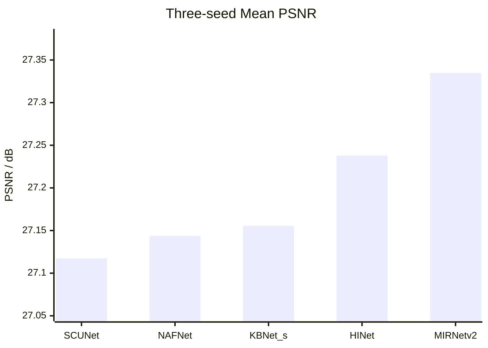

无法显示 Mermaid `xychart-beta` 时，可直接参考下方文本条形图：

```text
MIRNetv2  27.3348  ██████████████████████████████
HINet     27.2378  █████████████████████
KBNet_s   27.1555  ██████████
NAFNet    27.1438  █████████
SCUNet    27.1174  ██████
```

### 图 2：结果稳定性与平均性能关系

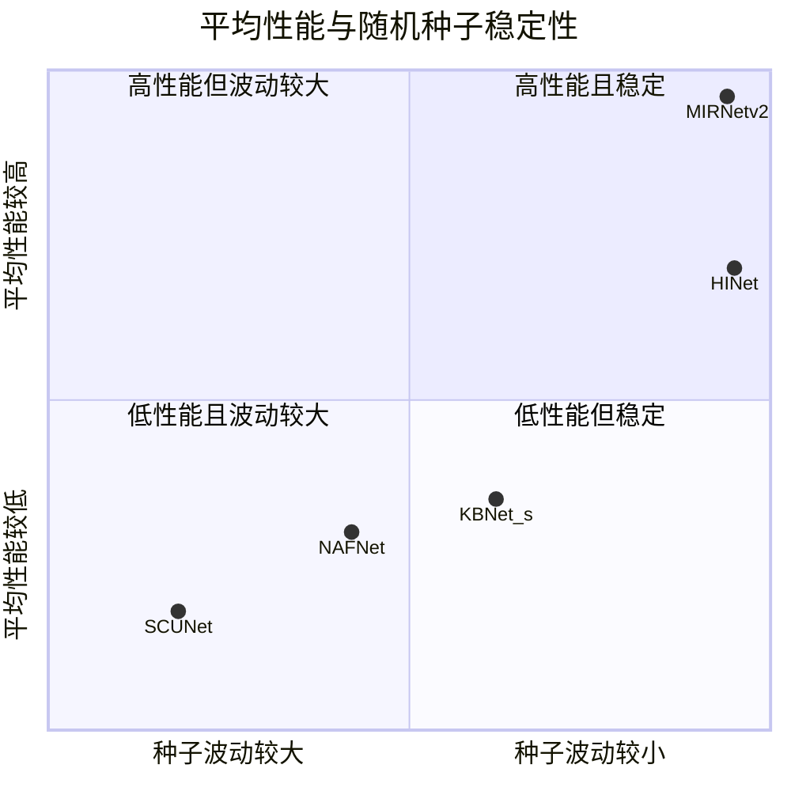

> 上图坐标是根据三种子均值和标准差做的相对位置示意，不是新的评价指标。

---

## 3. 从实验结果推断任务需要什么

### 3.1 MIRNetv2 的领先：多尺度上下文最重要

MIRNetv2 三个种子均排第一，并且标准差最小。仓库实现中的核心流程为：

1. 保留全分辨率主分支；
2. 生成中、低分辨率并行分支；
3. 各分支提取不同感受野的特征；
4. 将低分辨率上下文逐级融合回高分辨率分支；
5. 使用 SKFF 对不同尺度特征进行通道级自适应选择。

对应实现见：[`training/basicsr/models/archs/mirnet_v2_arch.py`](training/basicsr/models/archs/mirnet_v2_arch.py)。

### 图 3：MIRNetv2 给出的有效信息

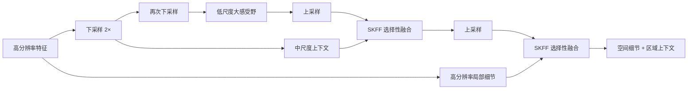

这说明当前单比特 SAR 恢复并不只需要逐像素或局部邻域处理。双向上采样、随机阈值量化以及后续成像会形成具有一定空间范围的结构性失真，模型需要在较大感受野内判断：

- 哪些纹理是目标结构；
- 哪些强弱变化属于量化伪影；
- 连续边缘应沿距离向还是方位向延伸；
- 均匀区域应保持平滑还是保留散射纹理。

### 3.2 HINet 的稳定次优：精修机制有效，但完整双阶段过重

HINet 采用两个串联 U-Net，并通过 SAM 和 CSFF 把第一阶段的输出与多尺度特征传递到第二阶段。它在三个种子中都稳定排第二，说明：

- 第一阶段先恢复主体结构；
- 第二阶段再修正细节和残留误差；
- 这种“粗恢复—细化”的思想适合当前任务。

但完整双阶段意味着重复编码器和解码器，参数、激活显存和实现复杂度都会明显增加。专利模型不需要完全复制 HINet，只需考虑一种更轻的精修形式，例如：

- 在输出端附加 2～3 个浅层残差块；
- 或使用门控跳跃连接减少浅层伪影直接进入解码器。

### 3.3 KBNet_s 与 NAFNet 接近：完整动态核收益不足

KBNet_s 的 KBA 会为每个空间位置预测 kernel basis 的组合系数，再形成位置自适应卷积核。该机制理论上适合处理不同局部结构，但当前结果仅比 NAFNet 平均高约 0.0116 dB，差距与随机种子波动处于同一量级。

仓库实现见：[`training/basicsr/models/archs/kbnet_s_arch.py`](training/basicsr/models/archs/kbnet_s_arch.py)。

### 图 4：完整 KBA 与推荐轻量方案的复杂度差异

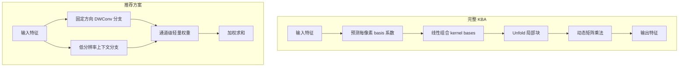

因此不建议把 KBA 大面积接入 NAFNet。若后续确实希望吸收 KBNet 的“自适应局部处理”思想，推荐只保留**少量固定方向分支 + 通道权重选择**，而不是逐像素生成卷积核。

### 3.4 SCUNet 最弱：不需要 Transformer

SCUNet 把 Swin Transformer 分支和卷积分支结合在 U-Net 中，理论上同时具有局部和非局部建模能力。但它在当前任务中平均结果最低，且随机种子波动最大。

这至少说明，在当前数据规模、训练预算和 256×256 SAR 图像条件下：

- 窗口自注意力没有带来可见收益；
- 重复纹理的非局部匹配并非主要瓶颈；
- 增加 Transformer 会提高实现复杂度，却缺乏实验依据。

因此不建议构建 NAFNet + Swin、NAFNet + MHSA 或 NAFNet + Restormer attention。

---

## 4. 为什么仍然选 NAFNet 作为基础模型

当前 NAFNet 配置位于：[`training/options/train/MixUpsample/NAFNet.yml`](training/options/train/MixUpsample/NAFNet.yml)。

核心结构位于：[`training/basicsr/models/archs/nafnet_arch.py`](training/basicsr/models/archs/nafnet_arch.py)。

### 4.1 当前 NAFBlock

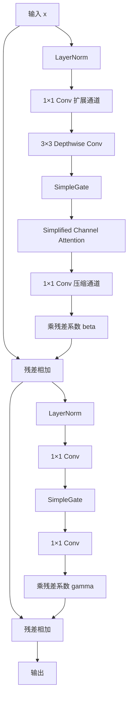

NAFNet 的优势不是当前指标最高，而是它提供了一个干净的实验平台：

- 主干是标准单阶段 U-Net；
- 每个新增模块的作用容易解释；
- 残差缩放参数初始化为零，训练稳定；
- 不需要复杂注意力和多阶段监督；
- 适合作为专利中的基础网络与实施例。

### 4.2 基础模型选择逻辑

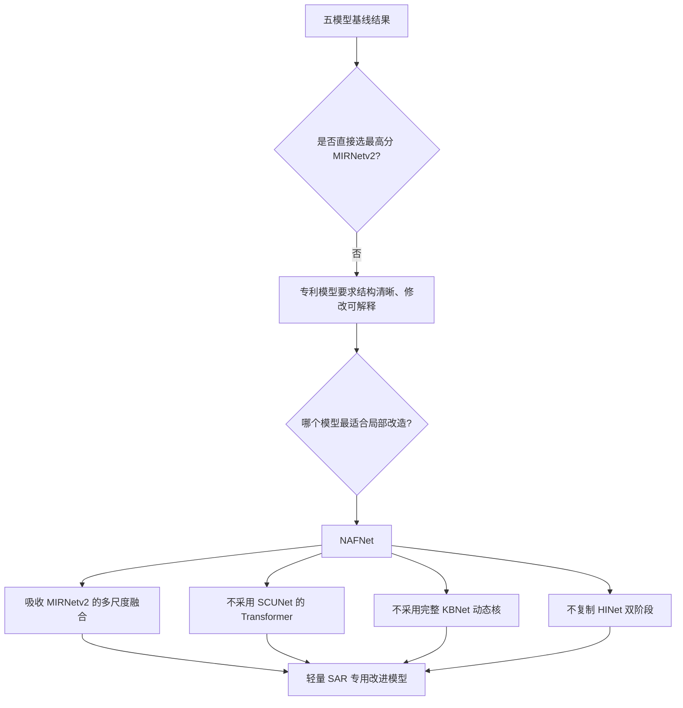

---

## 5. 推荐主模型：RA-MSF-NAFNet

### 5.1 核心思想

在 NAFNet 最低分辨率的瓶颈中加入一个轻量的 **Range–Azimuth Multi-Scale Fusion Block，RA-MSF Block**。

该模块针对 SAR 图像的两个物理方向分别提取特征：

- `1×5` 深度卷积：沿图像水平方向聚合；
- `5×1` 深度卷积：沿图像垂直方向聚合；
- 低分辨率上下文分支：通过池化扩大感受野；
- 选择性融合：根据当前输入自适应决定三个分支的通道权重。

需要依据数据数组的定义确认：图像行、列分别对应距离向还是方位向。文档中不固定把 `1×5` 写成距离向，实际代码和专利描述应以数据方向为准。

### 图 5：RA-MSF Block 总体结构

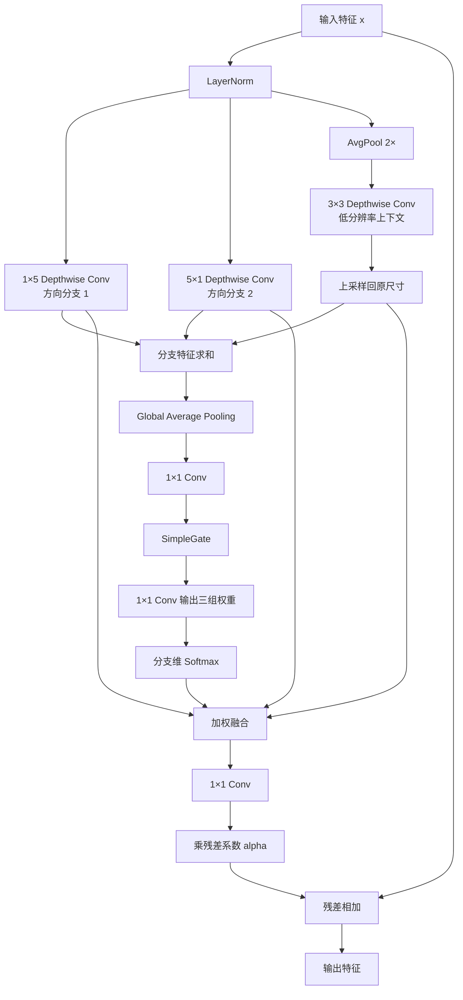

### 5.2 数学表达

设输入特征为：

$$
X\in\mathbb{R}^{B\times C\times H\times W}.
$$

归一化后分别生成三个分支：

$$
F_r=\operatorname{DWConv}_{1\times5}(\operatorname{LN}(X)),
$$

$$
F_a=\operatorname{DWConv}_{5\times1}(\operatorname{LN}(X)),
$$

$$
F_c=\operatorname{Up}\left(
\operatorname{DWConv}_{3\times3}
\left(\operatorname{Pool}_{2}(\operatorname{LN}(X))\right)
\right).
$$

首先聚合三个分支并提取全局通道描述：

$$
z=\operatorname{GAP}(F_r+F_a+F_c).
$$

通过轻量门控映射生成三个分支的通道权重：

$$
[w_r,w_a,w_c]
=\operatorname{Softmax}_{branch}
\left(
W_2\operatorname{SG}(W_1z)
\right).
$$

融合结果为：

$$
F=w_r\odot F_r+w_a\odot F_a+w_c\odot F_c.
$$

最终输出：

$$
Y=X+\alpha\cdot W_oF,
$$

其中 $\alpha$ 初始化为 0 或 $10^{-2}$，保证新增模块在训练初期接近恒等映射。

### 5.3 为什么放在瓶颈

当前 NAFNet 有四次下采样，256×256 输入在瓶颈处为 16×16。把 RA-MSF 放在这里有以下优势：

1. 同样大小的卷积核对应更大的原图有效感受野；
2. 池化和多分支特征的激活显存较低；
3. 不会显著增加高分辨率阶段的计算量；
4. 可避免对浅层散射纹理做过强平滑；
5. 模块数量少，便于专利流程图和消融实验。

### 图 6：模块在 NAFNet 中的位置

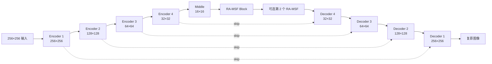

### 5.4 推荐实现方式

优先采用以下最小改动方式：

- 保持 `width=24`；
- 保持 `enc_blk_nums=[2,2,4,8]`；
- 保持 `dec_blk_nums=[2,2,2,2]`；
- 保持 `middle_blk_num=12`；
- 将最后 1 个或最后 2 个瓶颈 NAFBlock 替换成 RA-MSF Block；
- 不在所有尺度重复部署；
- 不改变输入输出残差结构；
- 训练损失先保持 L1。

推荐替换而不是额外堆叠，是为了控制参数量和训练预算，避免把性能提升简单归因于网络变深。

---

## 6. 可选改进：门控跳跃连接

当前 NAFNet 的跳跃连接为直接相加：

```python
x = x + enc_skip
```

浅层编码特征同时包含边缘细节和量化伪影。直接传递可能使部分伪影绕过瓶颈处理进入解码器。可以加入一个轻量门控：

$$
G=\operatorname{Sigmoid}
\left(
W_2\operatorname{SG}
\left(
W_1\operatorname{GAP}(F_e+F_d)
\right)
\right),
$$

$$
F_{out}=F_d+G\odot F_e,
$$

其中 $F_e$ 为编码器跳跃特征，$F_d$ 为当前解码特征。

### 图 7：门控跳跃连接

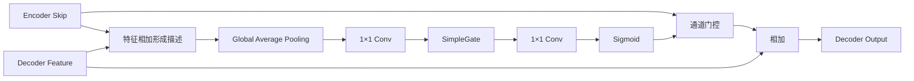

该模块应在 RA-MSF 完成初步验证后再加入，避免同时修改过多组件。

---

## 7. 可选改进：浅层输出精修头

若门控跳跃连接效果不明显，可测试一个更接近 HINet “第二阶段精修”思想、但远轻于第二个 U-Net 的输出精修头：

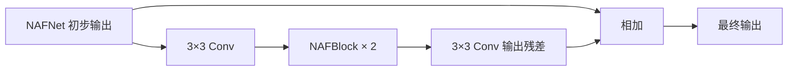

建议只使用 2 个浅层 NAFBlock，通道数 16 或 24。该分支用于修正残留误差，不重新进行多尺度编码。

优先级低于 RA-MSF，原因是：

- 它更接近增加网络深度；
- 专利解释不如距离向—方位向模块明确；
- 可能提高 PSNR，但未必具有足够明确的 SAR 特异性。

---

## 8. 不建议的改进方向

### 8.1 不建议完整接入 KBA

原因：

- KBNet_s 与 NAFNet 几乎打平；
- 动态核需要额外系数预测、unfold 和矩阵乘法；
- 推理与部署更复杂；
- 专利技术逻辑容易退化为“把已有 KBA 接到 NAFNet”。

### 8.2 不建议加入 Swin Transformer

原因：

- SCUNet 当前平均指标最低；
- 窗口注意力未体现优势；
- 会增加参数、显存与代码复杂度；
- 当前目标不是追求期刊级复杂架构。

### 8.3 不建议完整双阶段 U-Net

原因：

- HINet 虽然有效，但完整双阶段过重；
- 参数和激活显存明显增加；
- 难以维持“结构简单、便于部署”的专利实施例定位。

### 8.4 不建议一次性修改损失、网络和数据增强

若同时加入 RA-MSF、SSIM loss、梯度损失和新的增强方式，即使指标提升，也无法确定主要收益来自哪里。应先固定训练协议，只验证结构。

---

## 9. 最小消融实验方案

### 9.1 第一阶段：使用单个新种子快速筛选

当前训练配置已切换到 seed 45，可用 seed 45 做结构筛选：

| 实验编号 | 模型 | 目的 |
|---|---|---|
| A0 | 原始 NAFNet | 对照组 |
| A1 | NAFNet，最后 1 个 middle block 替换为 RA-MSF | 验证单模块有效性 |
| A2 | NAFNet，最后 2 个 middle block 替换为 RA-MSF | 验证模块数量 |
| A3 | A1/A2 最优者 + 门控跳跃连接 | 验证浅层伪影抑制 |
| A4 | A1/A2 最优者 + 浅层输出精修头 | 备选精修方案 |

### 图 8：实验决策流程

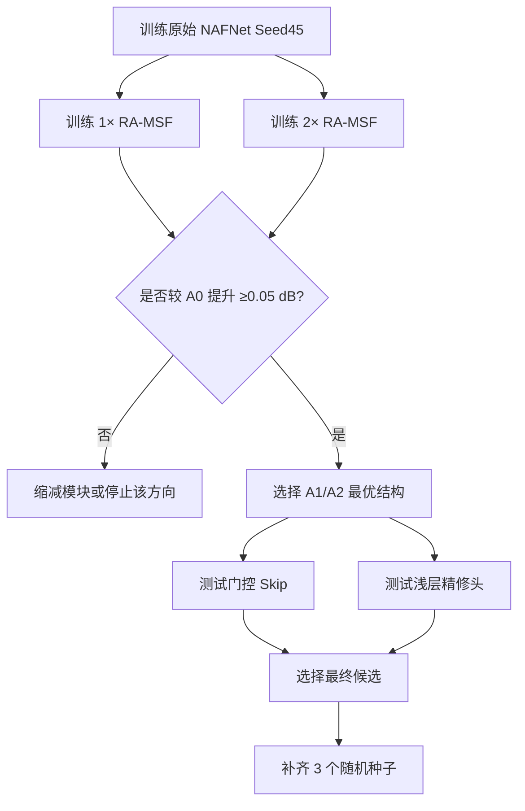

### 9.2 第二阶段：补齐多种子验证

最佳候选模型至少使用三个种子重新训练，并与原始 NAFNet 同训练协议比较。

建议最低通过标准：

1. 平均 PSNR 相对 NAFNet 提高至少 0.05 dB；
2. 平均 SSIM 不下降；
3. 三个种子中至少两个种子优于对应 NAFNet；
4. PSNR 标准差不显著增大；
5. 参数增量优先控制在 1M 内；
6. 单张推理时间和训练峰值显存增幅可接受。

### 9.3 需要记录的指标

除 PSNR、SSIM 外，建议增加：

| 类别 | 指标 |
|---|---|
| 准确性 | PSNR、SSIM |
| 稳定性 | 多种子均值、标准差、最差种子结果 |
| 复杂度 | 参数量、MACs、峰值显存、推理时间 |
| SAR 结构 | ENL、Entropy，必要时增加边缘保持指标 |
| 可视化 | 强散射点、均匀区域、条带结构、细弱边缘局部放大图 |

ENL 必须在预先固定的均匀区域上计算，不能为每个模型分别挑选有利区域。

---

## 10. 训练协议建议

结构筛选阶段继续沿用当前受控训练设置：

- 输入尺寸：256×256；
- 数据增强：随机翻转与旋转；
- 优化器：AdamW；
- 混合精度：BF16；
- warmup：总训练进度约 2%；
- 梯度裁剪：1.0；
- 损失：L1；
- 总样本曝光：与基线对齐约 20 万；
- 验证频率：总进度每 5% 验证一次。

结构确定后再测试以下损失，且每次只增加一种：

### 方案 L1：L1 + SSIM

$$
\mathcal{L}=\mathcal{L}_{1}+\lambda_s\mathcal{L}_{SSIM},
\quad \lambda_s\in\{0.02,0.05,0.1\}.
$$

### 方案 L2：L1 + 方向梯度损失

$$
\mathcal{L}=\mathcal{L}_{1}
+\lambda_r\|\nabla_r\hat I-\nabla_r I\|_1
+\lambda_a\|\nabla_a\hat I-\nabla_a I\|_1.
$$

方向梯度损失与 RA-MSF 的设计更一致，但应在网络结构已经验证有效后再测试。

---

## 11. 专利描述建议

### 11.1 可形成的技术问题

现有通用图像复原网络对单比特 SAR 图像处理时，通常采用各向同性卷积或通用注意力机制，未显式区分距离向和方位向结构，也未充分融合量化伪影所涉及的区域上下文，因此可能出现：

- 方向性边缘恢复不足；
- 强散射点附近伪影残留；
- 均匀区域噪声抑制与纹理保留失衡；
- 直接跳跃连接把浅层量化伪影传递至解码端。

### 11.2 可形成的技术方案

1. 对输入单比特 SAR 图像进行浅层特征提取；
2. 通过 U 形编码器获得多尺度特征；
3. 在低分辨率瓶颈中分别使用两个正交方向卷积提取距离向和方位向特征；
4. 通过下采样上下文分支获得大感受野特征；
5. 基于通道描述自适应生成各分支融合权重；
6. 将融合特征以可学习残差比例注入主干；
7. 通过解码器和可选门控跳跃连接重建高质量 SAR 图像。

### 图 9：专利实施流程图

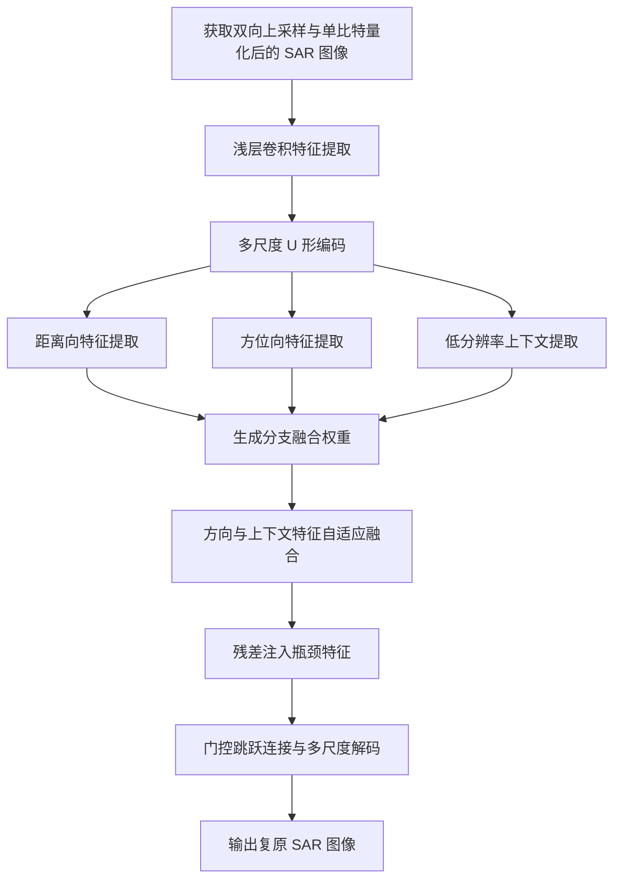

### 11.3 建议强调的创新点

相比“NAFNet 加注意力”这种宽泛描述，应强调以下组合关系：

1. **面向距离向和方位向的正交方向特征提取**；
2. **方向分支与低分辨率上下文分支联合建模**；
3. **根据当前 SAR 特征自适应选择不同分支**；
4. **只在瓶颈低分辨率部署以降低计算量**；
5. **通过残差缩放保证训练初期稳定**；
6. **可选门控跳跃连接抑制浅层量化伪影直接传播**。

单个已有模块通常难以构成足够完整的技术逻辑，专利应围绕上述模块之间的配合关系描述。

---

## 12. 最终推荐路线

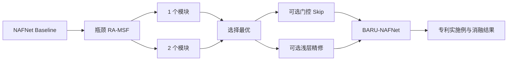

最终建议为：

> **继续使用 NAFNet 作为骨干，不引入 Transformer、不复制完整 KBA、不构建第二个完整 U-Net。首先实现一个位于 16×16 瓶颈处的距离向—方位向多尺度选择性融合模块，用最小消融验证其作用；若提升稳定，再测试门控跳跃连接。**

该方案的优势是：

- 有三随机种子基线结果支持；
- 能解释 MIRNetv2 为何领先；
- 与 SAR 双向结构和单比特量化退化具有明确对应关系；
- 参数和显存增量可控；
- 结构足够简单，符合专利模型而非复杂期刊模型的定位；
- 后续易于绘制网络结构图、实施流程图和消融表。
