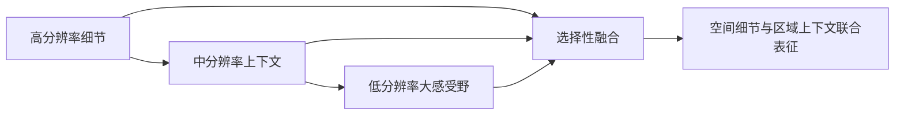
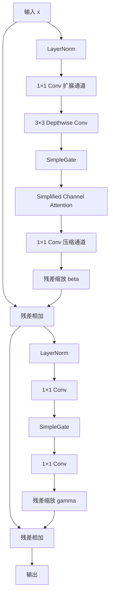
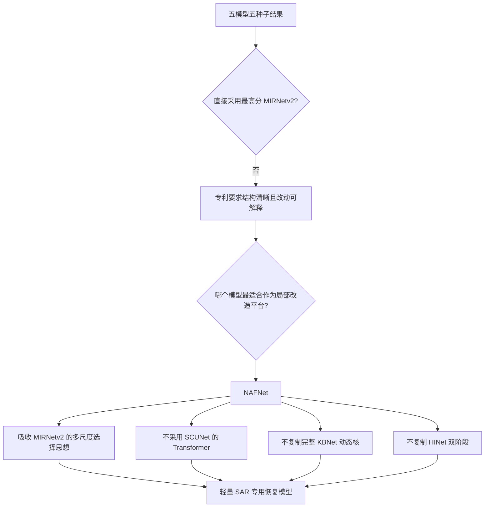
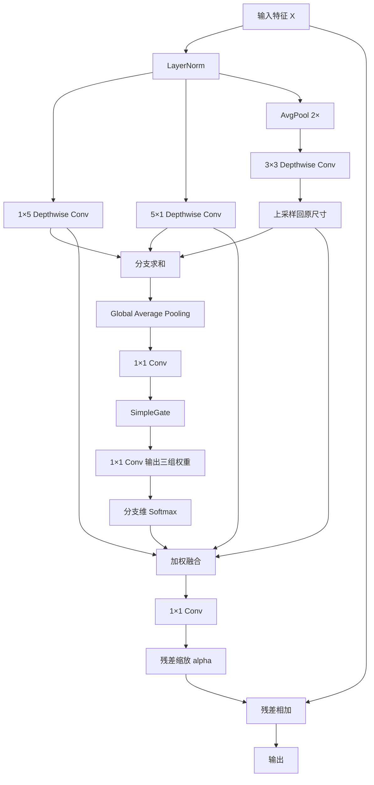
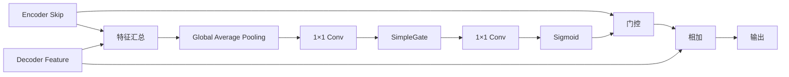
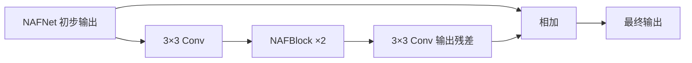
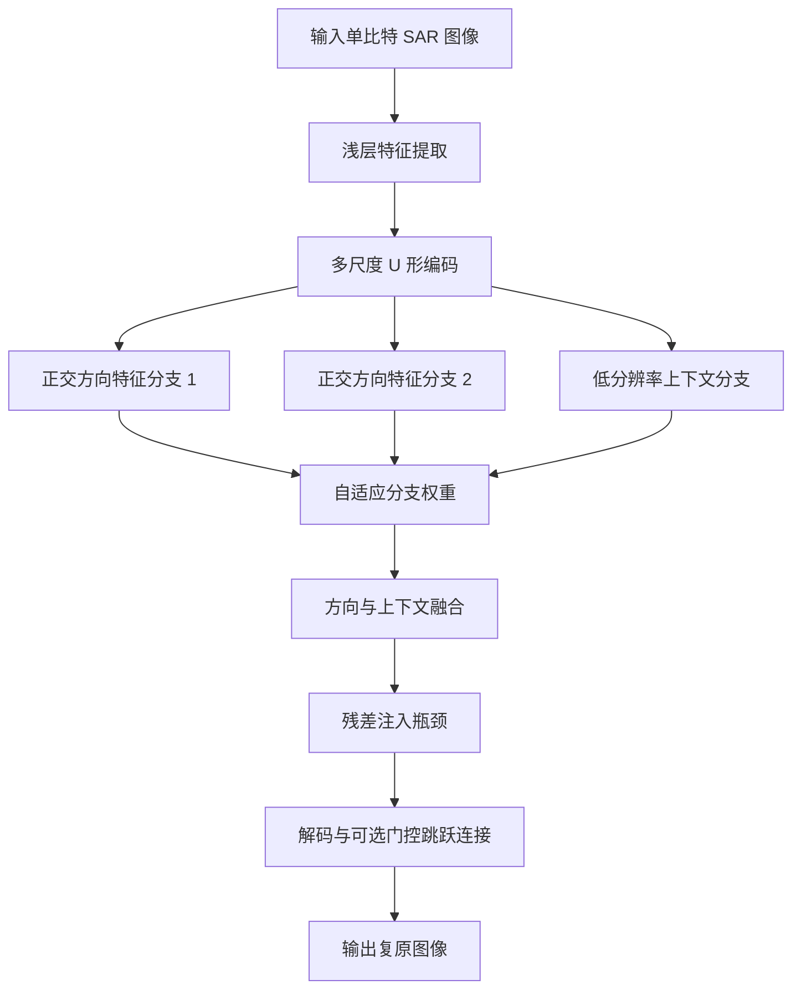
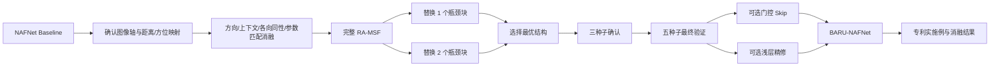

# 基于五模型完整基线实验的 NAFNet 改进建议

> 项目：BARU_Unet  
> 任务：双向上采样与随机阈值单比特 SAR 图像复原  
> 数据：MixUpsample Dataset R2A2，输入与目标均为 256×256  
> 当前结论依据：seed 42、43、44、45、46 五组完整基线结果  
> 文档定位：用于后续专利模型设计与最小规模消融，不按完整期刊论文的复杂度展开  
> 更新说明：本版替代原“三随机种子”版本，重新统计五种子结果，并调整模型判断、消融顺序与验收标准

---

## 1. 结论摘要

五个基线模型的五随机种子结果表明：

1. **MIRNetv2 的平均 PSNR/SSIM 最高，且五个种子均排名第一**；
2. **HINet 稳定排名第二，五种子方差最小或接近最小**；
3. **NAFNet 与 KBNet_s 在当前任务上基本打平**：NAFNet 的平均 PSNR 高 0.0023 dB，KBNet_s 的平均 SSIM 高 0.00020；
4. **SCUNet 平均性能最低**，说明当前训练规模和 256×256 SAR 图像条件下，Swin 窗口注意力没有形成有效收益；
5. NAFNet 的五种子 PSNR 波动相对较大，因此选择 NAFNet 作为骨干的主要理由不是“当前指标最稳定”，而是：
   - 单阶段 U-Net 结构清晰；
   - NAFBlock 组成简单；
   - 新增模块的作用容易隔离和解释；
   - 适合作为专利实施例中的基础恢复网络。

因此，推荐主线仍然是：

> **保留 NAFNet 单阶段 U-Net 主体，在低分辨率瓶颈处加入轻量的距离向—方位向多尺度选择性融合模块；先通过方向分支、上下文分支、各向同性对照和参数匹配对照验证模块作用，再决定是否增加门控跳跃连接。**

推荐名称：

- **BARU-NAFNet**：适合作为专利模型或项目名称；
- **RA-MSF-NAFNet**：Range–Azimuth Multi-Scale Fusion NAFNet，适合作为技术名称。

需要注意：加入 Softmax 或 Sigmoid 后，改进模型不再是严格意义上的“Nonlinear Activation Free Network”。专利和文档中应表述为“以 NAFNet 为骨干”或“基于 NAFBlock 的恢复网络”，而不应继续强调改进模型完全无显式非线性激活。

---

## 2. 完整基线实验结果

原始低质量图像与目标图像之间的基准指标为：

- PSNR：26.0884 dB
- SSIM：0.8024

完整原始记录见：

[`training/experiments/model_performence.md`](training/experiments/model_performence.md)

### 2.1 五个随机种子的原始结果

| 模型 | Seed 42 PSNR / SSIM | Seed 43 PSNR / SSIM | Seed 44 PSNR / SSIM | Seed 45 PSNR / SSIM | Seed 46 PSNR / SSIM |
|---|---:|---:|---:|---:|---:|
| HINet | 27.2454 / 0.8248 | 27.2332 / 0.8243 | 27.2348 / 0.8248 | 27.2519 / 0.8247 | 27.2562 / 0.8247 |
| KBNet_s | 27.1405 / 0.8236 | 27.1558 / 0.8242 | 27.1701 / 0.8242 | 27.2024 / 0.8247 | 27.1888 / 0.8237 |
| NAFNet | 27.1306 / 0.8236 | 27.1344 / 0.8241 | 27.1665 / 0.8242 | 27.2217 / 0.8237 | 27.2159 / 0.8238 |
| SCUNet | 27.0869 / 0.8211 | 27.1326 / 0.8217 | 27.1327 / 0.8216 | 27.1195 / 0.8213 | 27.1350 / 0.8217 |
| MIRNetv2 | 27.3272 / 0.8274 | 27.3404 / 0.8275 | 27.3369 / 0.8273 | 27.3573 / 0.8277 | 27.3392 / 0.8264 |

### 2.2 五种子均值与稳定性

下表使用五个随机种子的均值和样本标准差：

| 模型 | PSNR 均值 ± 标准差 | SSIM 均值 ± 标准差 | 相对原始输入 PSNR | 相对 NAFNet PSNR |
|---|---:|---:|---:|---:|
| **MIRNetv2** | **27.3402 ± 0.0109** | **0.82726 ± 0.00050** | +1.2518 dB | +0.1664 dB |
| **HINet** | **27.2443 ± 0.0102** | **0.82466 ± 0.00021** | +1.1559 dB | +0.0705 dB |
| **NAFNet** | 27.1738 ± 0.0434 | 0.82388 ± 0.00026 | +1.0854 dB | 0 |
| **KBNet_s** | 27.1715 ± 0.0248 | 0.82408 ± 0.00044 | +1.0831 dB | −0.0023 dB |
| **SCUNet** | 27.1213 ± 0.0202 | 0.82148 ± 0.00027 | +1.0329 dB | −0.0525 dB |

### 2.3 结果排名

```text
MIRNetv2  27.3402  ██████████████████████████████
HINet     27.2443  ██████████████████████
NAFNet    27.1738  ███████████
KBNet_s   27.1715  ███████████
SCUNet    27.1213  ██████
```

### 2.4 五种子结果带来的关键修正

与原三种子版本相比，需要修正以下判断：

1. **KBNet_s 不再稳定领先 NAFNet**  
   五种子下，两者可视为同一水平。完整 KBA 没有形成稳定净收益。

2. **MIRNetv2 不是标准差最小的模型**  
   MIRNetv2 的平均性能最高，HINet 的五种子波动更小。

3. **SCUNet 不是随机种子波动最大的模型**  
   SCUNet 的主要问题是平均性能最低，而非稳定性最差。

4. **NAFNet 的选择理由应从“指标折中”改为“结构可改造性”**  
   NAFNet 五种子 PSNR 标准差为 0.0434 dB，说明单种子筛选时必须谨慎。

---

## 3. 如何理解五个模型给出的结构信息

这些基线不是严格的单变量架构消融。各模型受显存限制，采用了不同 batch size、iteration 数和初始学习率，但总样本曝光量约对齐到 20 万。因此，它们适合用于：

- 判断哪类结构更值得优先尝试；
- 排除明显无效或代价过高的路线；
- 为专利模型设计提供结构假设。

它们不能严格证明某个单独模块是性能差异的唯一原因。

### 3.1 MIRNetv2：多尺度上下文与选择性融合是最值得验证的假设

MIRNetv2 五个种子均排名第一，平均领先 NAFNet 约 0.1664 dB。其核心机制包括：

1. 保留高分辨率主分支；
2. 生成中、低分辨率并行分支；
3. 在不同尺度提取不同感受野特征；
4. 将低分辨率上下文逐级融合回高分辨率分支；
5. 使用 SKFF 对不同尺度特征进行通道级自适应选择。

对应实现见：

[`training/basicsr/models/archs/mirnet_v2_arch.py`](training/basicsr/models/archs/mirnet_v2_arch.py)


```mermaid
flowchart LR
    A[高分辨率细节] --> F[选择性融合]
    A --> D1[中分辨率上下文]
    D1 --> F
    D1 --> D2[低分辨率大感受野]
    D2 --> F
    F --> O[空间细节与区域上下文联合表征]
```

合理推断是：

- 当前单比特 SAR 图像中的残留失真具有一定空间范围；
- 仅依靠局部 3×3 深度卷积可能不足；
- 不同区域需要不同尺度的上下文；
- 通道级选择性融合比固定相加更可能有效。

但应将这一结论表述为：

> **多尺度上下文与选择性融合是由基线结果支持的优先结构假设，而不是已被严格证明的唯一原因。**

### 3.2 HINet：粗恢复—精修思想有效，但不宜完整复制

HINet 五种子均排名第二，且结果稳定。其核心是：

- 两个串联 U-Net；
- 第一阶段恢复主体结构；
- 第二阶段修正残留误差；
- 通过 SAM 和 CSFF 传递图像与多尺度特征。

这说明“先恢复、再细化”的思路可能适合本任务。

但完整双阶段结构会带来：

- 更长的计算图；
- 更多中间激活；
- 更复杂的训练与实施描述；
- 更困难的模块归因。

因此不建议直接复制完整 HINet。可在主模块验证后，采用更轻的替代方案：

- 门控跳跃连接；
- 2 个浅层 NAFBlock 构成的输出精修头。

### 3.3 KBNet_s：完整动态核没有形成稳定收益

KBNet_s 的 KBA 为每个空间位置预测 kernel basis 组合系数，再形成位置自适应卷积核。理论上它适合处理不同局部结构。

但五种子结果为：

- NAFNet：27.1738 dB / 0.82388；
- KBNet_s：27.1715 dB / 0.82408。

差异远小于随机种子波动，可视为打平。

因此可以得出：

> **当前任务不支持大面积引入完整 KBA。动态核的额外系数预测、局部展开和矩阵运算没有换来稳定净收益。**

若要吸收 KBNet 的思想，应保留“输入自适应选择局部处理方式”，而不是完整复制像素级动态核。

推荐替代为：

- 少量固定方向卷积分支；
- 低分辨率上下文分支；
- 通道级轻量权重选择。

### 3.4 SCUNet：没有必要引入 Swin Transformer

SCUNet 平均 PSNR 和 SSIM 均最低。当前结果至少说明：

- 窗口自注意力没有形成可见收益；
- Transformer 增加的显存和实现复杂度缺乏实验回报；
- 当前任务的主要瓶颈可能不是窗口内非局部匹配。

因此不建议：

- NAFNet + Swin Block；
- NAFNet + MHSA；
- NAFNet + Restormer Attention；
- 大规模 Transformer-CNN 混合结构。

---

## 4. 为什么仍然选择 NAFNet 作为基础骨干

当前配置位于：

[`training/options/train/MixUpsample/NAFNet.yml`](training/options/train/MixUpsample/NAFNet.yml)

核心结构位于：

[`training/basicsr/models/archs/nafnet_arch.py`](training/basicsr/models/archs/nafnet_arch.py)

### 4.1 当前 NAFBlock


```mermaid
flowchart TB
    I[输入 x] --> N1[LayerNorm]
    N1 --> C1[1×1 Conv 扩展通道]
    C1 --> DW[3×3 Depthwise Conv]
    DW --> SG1[SimpleGate]
    SG1 --> SCA[Simplified Channel Attention]
    SCA --> C3[1×1 Conv 压缩通道]
    C3 --> BETA[残差缩放 beta]
    I --> ADD1[残差相加]
    BETA --> ADD1

    ADD1 --> N2[LayerNorm]
    N2 --> F1[1×1 Conv]
    F1 --> SG2[SimpleGate]
    SG2 --> F2[1×1 Conv]
    F2 --> GAMMA[残差缩放 gamma]
    ADD1 --> ADD2[残差相加]
    GAMMA --> ADD2
    ADD2 --> O[输出]
```

NAFNet 的主要优势：

- 主干是标准单阶段 U-Net；
- 每个新模块的插入位置清楚；
- NAFBlock 内部结构简单；
- 残差缩放参数从零开始，训练初期接近恒等映射；
- 不依赖复杂自注意力；
- 适合专利中的结构图、流程图和模块消融。

### 4.2 基础模型选择逻辑


```mermaid
flowchart TD
    A[五模型五种子结果] --> B{直接采用最高分 MIRNetv2?}
    B -->|否| C[专利要求结构清晰且改动可解释]
    C --> D{哪个模型最适合作为局部改造平台?}
    D --> N[NAFNet]
    N --> E[吸收 MIRNetv2 的多尺度选择思想]
    N --> F[不采用 SCUNet 的 Transformer]
    N --> G[不复制完整 KBNet 动态核]
    N --> H[不复制 HINet 双阶段]
    E --> O[轻量 SAR 专用恢复模型]
    F --> O
    G --> O
    H --> O
```

结论：

> **选择 NAFNet 是工程和专利设计选择，不是因为它在当前五模型中性能最高或最稳定。**

---

## 5. 推荐主模型：RA-MSF-NAFNet

## 5.1 核心思想

在 NAFNet 最低分辨率的瓶颈中加入轻量的 **Range–Azimuth Multi-Scale Fusion Block，RA-MSF Block**。

模块由三条分支组成：

1. 水平方向深度卷积分支：`1×5 DWConv`；
2. 垂直方向深度卷积分支：`5×1 DWConv`；
3. 低分辨率上下文分支：池化后 `3×3 DWConv`，再上采样回原尺寸。

随后通过轻量通道描述生成三组分支权重，并完成选择性融合。

### 重要前置条件

必须先确认成像结果数组的轴定义：

- 图像行方向对应距离向还是方位向；
- 图像列方向对应距离向还是方位向；
- 裁剪、转置、保存 PNG 后是否改变方向关系。

在方向映射未确认前，只能称为：

- 水平方向分支；
- 垂直方向分支。

不能直接把 `1×5` 固定写成距离向卷积或方位向卷积。

### 5.2 模块结构


```mermaid
flowchart TB
    X[输入特征 X] --> LN[LayerNorm]

    LN --> R[1×5 Depthwise Conv]
    LN --> A[5×1 Depthwise Conv]
    LN --> P[AvgPool 2×]
    P --> C[3×3 Depthwise Conv]
    C --> U[上采样回原尺寸]

    R --> SUM[分支求和]
    A --> SUM
    U --> SUM
    SUM --> GAP[Global Average Pooling]
    GAP --> W1[1×1 Conv]
    W1 --> SG[SimpleGate]
    SG --> W2[1×1 Conv 输出三组权重]
    W2 --> SM[分支维 Softmax]

    R --> F[加权融合]
    A --> F
    U --> F
    SM --> F
    F --> OUT[1×1 Conv]
    OUT --> ALPHA[残差缩放 alpha]
    X --> ADD[残差相加]
    ALPHA --> ADD
    ADD --> Y[输出]
```

### 5.3 数学表达

设输入为：

$$
X\in\mathbb{R}^{B\times C\times H\times W}.
$$

归一化后产生三个分支：

$$
F_h=\operatorname{DWConv}_{1\times5}(\operatorname{LN}(X)),
$$

$$
F_v=\operatorname{DWConv}_{5\times1}(\operatorname{LN}(X)),
$$

$$
F_c=\operatorname{Up}\left[
\operatorname{DWConv}_{3\times3}
\left(
\operatorname{Pool}_{2}(\operatorname{LN}(X))
\right)
\right].
$$

全局通道描述为：

$$
z=\operatorname{GAP}(F_h+F_v+F_c).
$$

生成分支权重：

$$
[w_h,w_v,w_c]
=
\operatorname{Softmax}_{branch}
\left[
W_2\operatorname{SG}(W_1z)
\right].
$$

融合结果：

$$
F=w_h\odot F_h+w_v\odot F_v+w_c\odot F_c.
$$

最终输出：

$$
Y=X+\alpha W_oF,
$$

其中 $\alpha$ 建议初始化为 0，使模块在训练初期接近恒等映射。

### 5.4 为什么部署在瓶颈

当前 NAFNet 经过四次下采样，256×256 输入在瓶颈处为 16×16。

瓶颈部署的优势：

1. 同样卷积核在原图上具有更大的等效感受野；
2. 多分支激活显存较低；
3. 参数和 MACs 增量可控；
4. 不会在高分辨率浅层过度平滑散射纹理；
5. 模块数量少，便于专利描述；
6. 更容易与原始 NAFNet 做参数匹配对照。

### 5.5 推荐实现方式

保持当前 NAFNet 基础配置：

- `width=24`
- `enc_blk_nums=[2,2,4,8]`
- `dec_blk_nums=[2,2,2,2]`
- `middle_blk_num=12`
- 输入输出残差结构不变
- 第一阶段损失保持 L1

优先采用“替换”而非“额外堆叠”：

- 将最后 1 个瓶颈 NAFBlock 替换为 RA-MSF；
- 若有效，再测试替换最后 2 个；
- 不在所有尺度重复部署。

这样可避免把提升简单归因于网络变深。

---

## 6. 主模块必须包含的对照实验

原方案只比较“1 个或 2 个 RA-MSF”，不足以证明提升来自距离—方位方向建模。专利实施例至少应加入以下对照。

### 6.1 参数匹配的额外 NAFBlock

目的：

- 排除性能提升仅来自额外参数或计算量。

设计：

- 原始 NAFNet；
- 增加或替换一个参数量近似的 NAFBlock；
- 完整 RA-MSF。

若 RA-MSF 仅与额外 NAFBlock 持平，则其结构必要性不足。

### 6.2 仅方向分支

保留：

- `1×5 DWConv`
- `5×1 DWConv`

去除：

- 低分辨率上下文分支。

用于验证正交方向处理本身是否有效。

### 6.3 仅上下文分支

只保留：

- Pool 2×；
- `3×3 DWConv`；
- 上采样；
- 残差注入。

用于验证提升是否主要来自扩大感受野。

### 6.4 各向同性多尺度对照

将方向分支替换为各向同性卷积，例如：

- `3×3 DWConv + 5×5 DWConv`；
- 或 `3×3 DWConv + dilation=2 的 3×3 DWConv`。

要求：

- 参数量和 MACs 尽量与 RA-MSF 接近；
- 融合方式保持一致。

若 RA-MSF 优于各向同性对照，才能更有力地支持“距离向—方位向分解”的 SAR 特异性。

### 6.5 固定融合与自适应融合对照

比较：

1. 三分支直接相加；
2. 三分支固定平均；
3. 通道级 Softmax 选择性融合。

用于验证自适应权重是否必要。

---

## 7. 可选改进一：门控跳跃连接

当前 NAFNet 的跳跃连接是直接相加：

```python
x = x + enc_skip
```

浅层编码特征中既包含边缘与散射细节，也可能包含量化伪影。直接相加可能使部分伪影绕过瓶颈处理。

推荐门控形式：

$$
G=\operatorname{Sigmoid}
\left[
W_2\operatorname{SG}
\left(
W_1\operatorname{GAP}(F_e+F_d)
\right)
\right],
$$

$$
F_{out}=F_d+G\odot F_e,
$$

其中：

- $F_e$：编码器跳跃特征；
- $F_d$：当前解码特征；
- $G$：通道门控系数。


```mermaid
flowchart LR
    E[Encoder Skip] --> S[特征汇总]
    D[Decoder Feature] --> S
    S --> GAP[Global Average Pooling]
    GAP --> C1[1×1 Conv]
    C1 --> SG[SimpleGate]
    SG --> C2[1×1 Conv]
    C2 --> SIG[Sigmoid]
    E --> MUL[门控]
    SIG --> MUL
    MUL --> ADD[相加]
    D --> ADD
    ADD --> O[输出]
```

门控跳跃连接只能在 RA-MSF 已经稳定有效后测试，避免同时引入两个未经验证的模块。

建议优先只在较深的两个 skip 上使用，原因是：

- 深层 skip 具有更强语义和更低空间分辨率；
- 计算增量更低；
- 避免浅层门控破坏细节。

---

## 8. 可选改进二：浅层输出精修头

若门控跳跃连接效果不明显，可测试轻量输出精修：


```mermaid
flowchart LR
    N[NAFNet 初步输出] --> C1[3×3 Conv]
    C1 --> B1[NAFBlock ×2]
    B1 --> C2[3×3 Conv 输出残差]
    N --> ADD[相加]
    C2 --> ADD
    ADD --> O[最终输出]
```

建议：

- 只使用 2 个浅层 NAFBlock；
- 通道数 16 或 24；
- 不重新进行多尺度编码；
- 输出为残差修正量。

该方案的优先级低于 RA-MSF 和门控 skip，因为：

- 更接近单纯增加网络深度；
- SAR 特异性较弱；
- 专利解释力度不如方向—上下文联合建模。

---

## 9. 不建议的改进方向

### 9.1 不建议完整接入 KBA

原因：

- 五种子下 KBNet_s 与 NAFNet 基本打平；
- 完整动态核没有稳定净收益；
- 需要额外系数预测、局部展开和动态矩阵运算；
- 实现与部署复杂；
- 专利容易退化为已有模块拼接。

### 9.2 不建议加入 Swin Transformer

原因：

- SCUNet 五种子平均性能最低；
- 当前数据规模未体现窗口注意力优势；
- 会显著提高代码和显存复杂度；
- 不符合轻量专利模型定位。

### 9.3 不建议完整双阶段 U-Net

原因：

- HINet 虽然有效，但完整双阶段不利于结构简化；
- 计算图和激活显存更复杂；
- 难以明确归因新增模块；
- 专利实施例没有必要复制完整第二阶段。

### 9.4 不建议一次性修改结构、损失和增强

第一阶段只验证网络结构。

不要同时加入：

- RA-MSF；
- SSIM loss；
- 方向梯度损失；
- 新数据增强；
- 新采样策略。

否则无法判断提升来源。

### 9.5 不建议过早在所有尺度部署新模块

高分辨率阶段多分支处理会：

- 增加显存；
- 增加 MACs；
- 可能过度平滑散射细节；
- 使专利结构复杂化。

优先只在 16×16 瓶颈验证。

---

## 10. 更新后的最小消融实验方案

## 10.1 第一阶段：单种子结构快筛

推荐使用 **seed 44** 作为第一轮筛选种子。

理由：

- seed 44 的 NAFNet 为 27.1665 dB；
- 与五种子均值 27.1738 dB 最接近；
- 比 seed 45、46 更适合作为中性基线。

实验表：

| 编号 | 模型 | 目的 |
|---|---|---|
| A0 | 原始 NAFNet | 基线 |
| A1 | 参数近似匹配的 NAFBlock 对照 | 排除参数量收益 |
| A2 | 仅方向分支 | 验证正交方向建模 |
| A3 | 仅上下文分支 | 验证大感受野上下文 |
| A4 | 完整 RA-MSF，固定平均融合 | 验证三分支联合建模 |
| A5 | 完整 RA-MSF，自适应融合 | 验证选择性权重 |
| A6 | 各向同性多尺度对照 | 验证方向分解的必要性 |
| A7 | A5 最优结构，替换 2 个瓶颈块 | 验证模块数量 |
| A8 | A5/A7 最优者 + 深层门控 skip | 验证浅层伪影传播抑制 |
| A9 | A5/A7 最优者 + 浅层精修头 | 备选精修方案 |

### 10.2 单种子决策规则

由于 NAFNet 五种子 PSNR 标准差达到 0.0434 dB，不应使用过于刚性的单种子阈值。

建议：

- 提升 **≥0.05 dB**：直接进入多种子验证；
- 提升 **0.02–0.05 dB**：增加第二个种子后再决定；
- 提升 **<0.02 dB**，且 SSIM、可视化均无改善：停止该变体；
- PSNR 小幅下降但 SSIM、强散射点和边缘明显改善：保留为备选，不直接淘汰。

### 10.3 第二阶段：三种子确认

对第一阶段候选，使用：

- seed 42：相对较弱的 NAFNet 基线；
- seed 44：接近均值；
- seed 45：相对较强的 NAFNet 基线。

目标是检查改进是否跨不同基线状态仍有效。

### 10.4 第三阶段：五种子最终验证

最终候选与原始 NAFNet 使用 seed 42–46 全部重训。

最低建议通过标准：

1. 五种子平均 PSNR 相对 NAFNet 提升至少约 0.05 dB；
2. 平均 SSIM 不下降；
3. 五个种子中至少四个优于对应 NAFNet，或至少三个明显优于且无严重退化种子；
4. PSNR 标准差不明显高于原始 NAFNet；
5. 参数增量优先控制在 1M 内；
6. MACs、峰值显存和推理时间增幅可接受；
7. 方向分支应优于参数匹配的各向同性对照；
8. 完整模块应优于仅方向分支和仅上下文分支中的至少一个。

---

## 11. 需要记录的指标

| 类别 | 指标 |
|---|---|
| 准确性 | PSNR、SSIM |
| 稳定性 | 五种子均值、样本标准差、最差种子结果 |
| 复杂度 | 参数量、MACs、峰值显存、单张推理时间 |
| 收敛 | 最佳 iteration、最终 iteration、验证曲线 |
| SAR 统计 | ENL、Entropy |
| 结构保持 | 边缘保持、方向梯度误差，可选 |
| 可视化 | 强散射点、均匀区域、条带结构、细弱边缘局部放大 |

注意：

- ENL 必须使用预先固定的均匀 ROI；
- 所有模型使用同一 ROI；
- 不能为不同模型分别挑选有利区域；
- PSNR/SSIM 仍是主排序指标；
- ENL 和 Entropy 作为图像统计参考，不单独决定模型优劣。

---

## 12. 训练协议建议

结构筛选阶段保持当前受控训练协议：

- 输入尺寸：256×256；
- 数据增强：随机翻转与旋转；
- 优化器：AdamW；
- 混合精度：BF16；
- warmup：总训练进度约 2%；
- 梯度裁剪：1.0；
- 损失：L1；
- 总样本曝光：约 20 万；
- 验证频率：总训练进度每 5%；
- 数据划分与指标实现保持不变。

### 12.1 参数公平性

RA-MSF 与对照模型应报告：

- 参数量；
- MACs；
- 峰值显存；
- 推理时间。

优先通过“替换 NAFBlock”控制复杂度，而不是直接额外堆叠。

### 12.2 结构确定后的损失实验

只有在结构已通过五种子验证后，才测试损失函数。

#### 方案 L1：L1 + SSIM

$$
\mathcal{L}
=
\mathcal{L}_{1}
+
\lambda_s\mathcal{L}_{SSIM},
\qquad
\lambda_s\in\{0.02,0.05,0.1\}.
$$

#### 方案 L2：L1 + 方向梯度损失

$$
\mathcal{L}
=
\mathcal{L}_{1}
+
\lambda_r
\left\|
\nabla_r\hat I-\nabla_r I
\right\|_1
+
\lambda_a
\left\|
\nabla_a\hat I-\nabla_a I
\right\|_1.
$$

方向梯度损失与 RA-MSF 的物理解释更一致，但必须在行列轴对应关系确认后使用。

---

## 13. 专利描述建议

### 13.1 技术问题

现有通用图像复原网络处理单比特 SAR 图像时，通常采用各向同性卷积或通用注意力机制，未显式区分距离向和方位向结构，也未充分结合量化伪影的区域上下文，可能导致：

- 方向性边缘恢复不足；
- 强散射点附近伪影残留；
- 均匀区域平滑与纹理保持失衡；
- 浅层跳跃特征将量化伪影直接传递至解码器。

### 13.2 技术方案

1. 输入经双向上采样和单比特量化形成的 SAR 图像；
2. 通过浅层卷积提取基础特征；
3. 通过 U 形编码器获得多尺度特征；
4. 在低分辨率瓶颈中分别沿两个正交方向提取特征；
5. 通过下采样上下文分支提取大感受野信息；
6. 根据当前特征生成方向分支和上下文分支的融合权重；
7. 将融合特征以可学习残差比例注入主干；
8. 通过解码器和可选门控跳跃连接恢复高质量 SAR 图像。


```mermaid
flowchart TD
    S1[输入单比特 SAR 图像] --> S2[浅层特征提取]
    S2 --> S3[多尺度 U 形编码]
    S3 --> S4[正交方向特征分支 1]
    S3 --> S5[正交方向特征分支 2]
    S3 --> S6[低分辨率上下文分支]
    S4 --> S7[自适应分支权重]
    S5 --> S7
    S6 --> S7
    S7 --> S8[方向与上下文融合]
    S8 --> S9[残差注入瓶颈]
    S9 --> S10[解码与可选门控跳跃连接]
    S10 --> S11[输出复原图像]
```

### 13.3 建议强调的创新组合

专利中不应只描述成“NAFNet 加注意力”，而应强调以下组合：

1. 面向 SAR 两个物理方向的正交方向特征提取；
2. 方向分支与低分辨率上下文分支联合建模；
3. 根据输入特征自适应选择不同分支；
4. 仅在低分辨率瓶颈部署，控制参数和显存；
5. 通过残差缩放保证训练初期稳定；
6. 通过门控跳跃连接抑制浅层量化伪影直接传播；
7. 通过参数匹配和各向同性对照证明方向分解的技术效果。

### 13.4 表述边界

当前基线结果仅支持：

- 多尺度选择性融合值得优先验证；
- 完整动态核与 Transformer 不值得优先采用；
- NAFNet 适合作为清晰的改造骨干。

在 RA-MSF 消融结果完成前，不能直接宣称：

- 方向分支一定有效；
- 距离向与方位向建模一定优于各向同性多尺度；
- 门控 skip 一定能抑制量化伪影。

这些结论需要由后续实验支持。

---

## 14. 数据集变更时的处理原则

当前五模型基线和本建议均基于：

- R2A2 双向上采样；
- RT 阈值；
- 当前 MixUpsample 数据集；
- 当前训练与测试划分。

若后续专利数据集改为新的阈值方案或新的 BARU 数据生成方式，则：

1. 当前五模型结果只能作为旧数据集基线；
2. 不应直接作为新数据集的最终模型排序；
3. 至少需要在新数据集上重新训练：
   - NAFNet；
   - MIRNetv2；
   - 最终改进模型；
4. 若预算允许，补充 HINet；
5. 旧数据集结果可作为退化方式变化的补充消融，而不是主结论。

---

## 15. 最终推荐路线


```mermaid
flowchart LR
    BASE[NAFNet Baseline] --> AXIS[确认图像轴与距离/方位映射]
    AXIS --> ABL[方向/上下文/各向同性/参数匹配消融]
    ABL --> MAIN[完整 RA-MSF]
    MAIN --> N1[替换 1 个瓶颈块]
    MAIN --> N2[替换 2 个瓶颈块]
    N1 --> BEST[选择最优结构]
    N2 --> BEST
    BEST --> S3[三种子确认]
    S3 --> S5[五种子最终验证]
    S5 --> SKIP[可选门控 Skip]
    S5 --> REFINE[可选浅层精修]
    SKIP --> FINAL[BARU-NAFNet]
    REFINE --> FINAL
    FINAL --> PATENT[专利实施例与消融结果]
```

最终建议：

> **继续以 NAFNet 为基础骨干，但明确其价值在于结构简单和改造可解释，而不是当前性能最高。首先确认 SAR 图像行列轴的物理方向，然后在 16×16 瓶颈处验证距离向—方位向多尺度选择性融合。实验必须包含参数匹配 NAFBlock、仅方向分支、仅上下文分支、各向同性多尺度和固定/自适应融合对照。主模块在三种子和五种子下稳定有效后，再测试门控跳跃连接或浅层精修头。**

该路线的优势：

- 有五随机种子完整基线支持；
- 能合理吸收 MIRNetv2 的优势；
- 避免复制完整 KBA、Transformer 或双阶段 U-Net；
- 与 SAR 距离向—方位向结构具有明确联系；
- 参数与显存增量可控；
- 适合形成专利结构图、实施流程和消融证据链；
- 后续即使主模块收益有限，也可以通过完整对照迅速判断是方向建模、上下文还是融合策略的问题。
